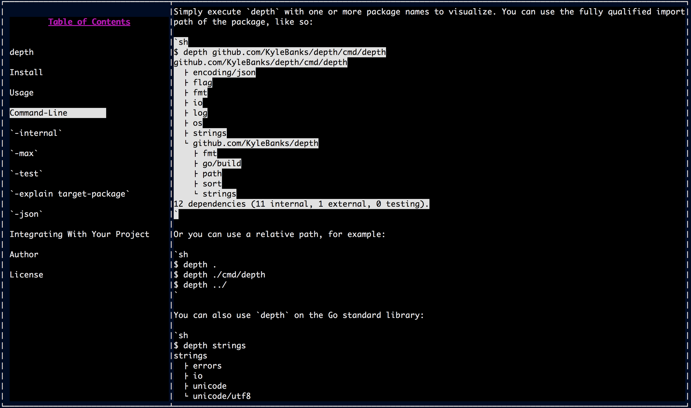

# kurz

[](https://godoc.org/github.com/KyleBanks/kurz)&nbsp; 
[](https://travis-ci.org/KyleBanks/kurz)&nbsp;
[](https://goreportcard.com/report/github.com/KyleBanks/kurz)&nbsp;
[](https://coveralls.io/github/KyleBanks/kurz?branch=master)


**This project is very early and is in active development!**

`kurz` allows you to view markdown documents on the command-line in a feature-rich UI. 



## Features

- **TODO** Expand/collapse sections
- **TODO** Copy selected text to your clipboard
- **TODO** Load remote or local files
- **TODO** Cache remote files for offline access
- **TODO** Automatically discover README of remote Git repositories on GitHub, BitBucket and GitLab
- **TODO** Syntax highlighting for code snippets

## Usage

There are three primary ways to use `kurz`:

1. Load a local markdown file: 

```
$ kurz ./path/to/file.md
```

2. Or use a remote URL:

```
$ kurz https://example.com/markdown-file.md
```

3. Provide a Git repository to view its README:

```
$ kurz github.com/KyleBanks/kurz
```
