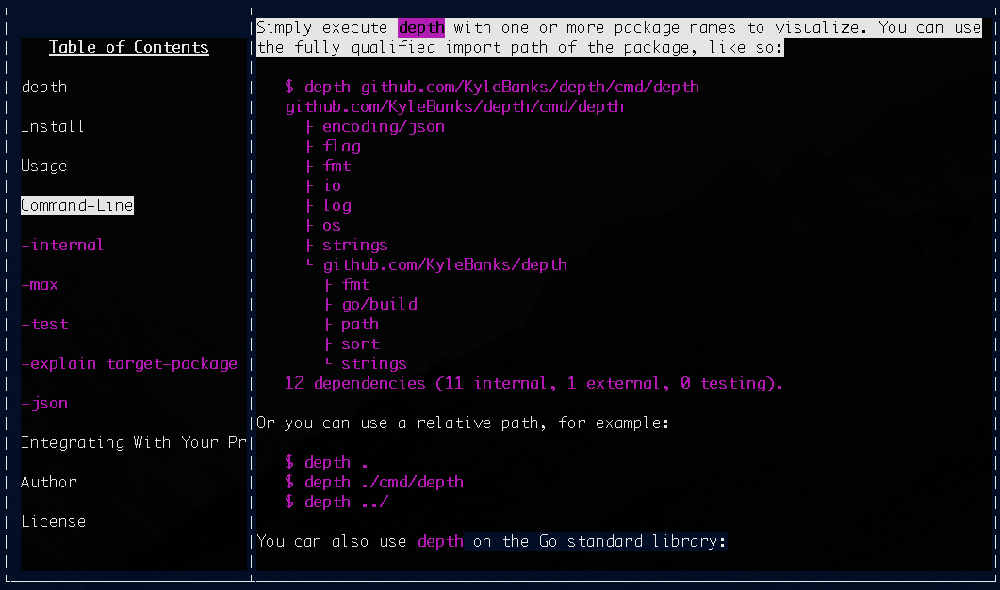

# kurz

**This project is very early and is in active development!**

`kurz` allows you to view markdown documents on the command-line in a feature-rich UI. 



## Features

- [TODO] Expand/collapse sections
- [TODO] Copy selected text to your clipboard
- [TODO] Load remote or local files
- [TODO] Cache remote files for offline access
- [TODO] Automatically discover README of remote Git repositories on GitHub, BitBucket and GitLab

## Usage

There are three primary ways to use `kurz`:

1. Load a local markdown file: 

```
$ kurz ./path/to/file.md
```

2. Or use a remote URL:

```
$ kurz https://example.com/markdown-file.md
```

3. Provide a Git repository to view its README:

```
$ kurz github.com/KyleBanks/depth
```
